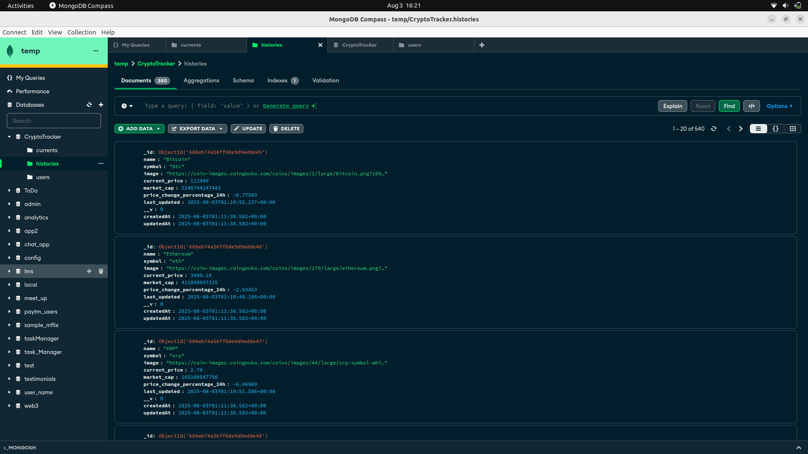
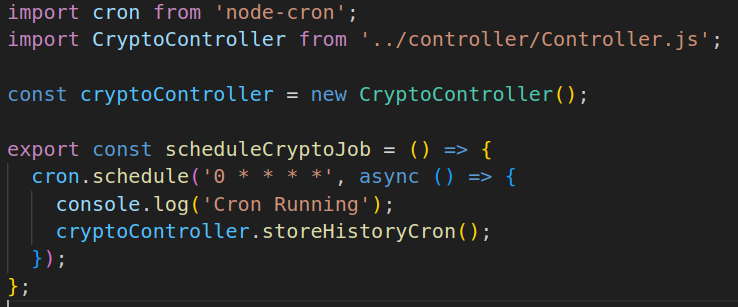

# 📊 Crypto Tracker

This is a full-stack MERN application that tracks cryptocurrency data and displays it on a dynamic dashboard. The application is structured using Git submodules to separate concerns for better modularity and development workflow.

---

## 🌐 Live URLs

- **Frontend:** [https://crypto-frontend-kx2k.vercel.app/](https://crypto-frontend-kx2k.vercel.app/)
- **Backend (API):** [https://cryptobackend-production-96fd.up.railway.app/](https://cryptobackend-production-96fd.up.railway.app/)

---

## 📁 Folder Structure

This monorepo includes both client and server as Git submodules for best practices.

cryptoTracker/
├── client/ → Frontend (React + Vite)
├── server/ → Backend (Node.js + Express + MongoDB)


> Please note that both `client` and `server` folders are added as Git submodules.

---

## 🛠 Tech Stack

- **Frontend:** React, Vite, Tailwind CSS
- **Backend:** Node.js, Express, MongoDB, Mongoose
- **Task Scheduling:** Node Cron
- **Deployment:** 
  - Frontend on Vercel  : [https://crypto-frontend-kx2k.vercel.app/](https://crypto-frontend-kx2k.vercel.app/)
  - Backend on Railway  : [https://cryptobackend-production-96fd.up.railway.app/](https://cryptobackend-production-96fd.up.railway.app/)

---

## ⚙️ Setup & Installation

> Make sure you have `git`, `Node.js`, and `npm` installed on your system.

### 1. Clone this repository:
```bash
git clone --recurse-submodules https://github.com/Ashdeep-Singh-97/cryptoTracker.git
cd cryptoTracker

2. Set up Frontend:

cd client
npm install
npm run dev  # or npm run build && npm run preview

3. Set up Backend:

cd ../server
npm install
npm run dev  # or node src/index.js

⏱️ How the Cron Job Works

    The backend contains a cron job using node-cron.

    It runs at fixed intervals (as defined in the code) to fetch the latest cryptocurrency prices and store them in the MongoDB database. We call the function responsible for updating prices using it's controller and run it periodically :

    This ensures your dashboard always reflects the most recent market data.

📸 Screenshots

✅ Sample Database Data


✅ Deliverables Summary

Live frontend URL

Live backend API URL

GitHub repo with /client and /server submodules

README with complete setup and working explanation

Cron job implemented and running

Screenshots of database and cron job